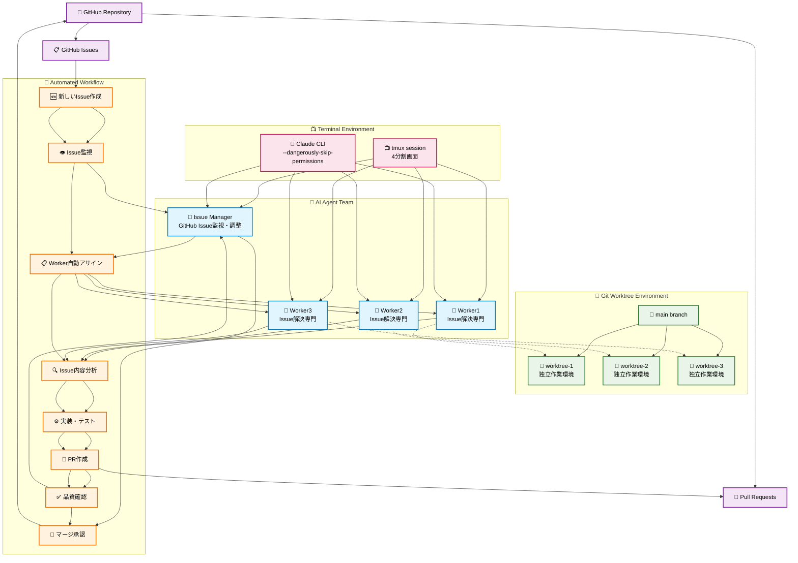
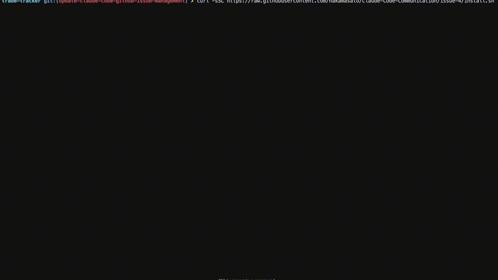

# 🤖 Claude Code GitHub Issue Management

GitHub Issueを自動管理する、AI駆動の開発ワークフローシステムです。

[Claude Code エージェント通信システム](https://github.com/Akira-Papa/Claude-Code-Communication)にヒントを得て、もともと手元でやっていたGitHub Issueを作ってそれをClaude Codeに解決してもらうやり方をAI Workerで実行できるようにしました。

## 📌 これは何？

**3行で説明すると：**
1. GitHub Issueを自動監視・管理するAI Issue Managerと複数のWorkerが協力（デフォルト3、setup.shで指定可能）
2. IssueがオープンされるとWorkerに自動アサイン、解決後に自動PR作成
3. 完全自動化されたGitHub Issue → PR → マージのワークフロー

**システムの特徴：**
- 🔄 GitHub Issue自動監視・アサイン
- 🚀 Git worktreeを使った並列開発
- 📝 自動PR作成とIssue進捗コメント
- ⚡ 複数Issue同時処理（worker数に応じて、デフォルト最大3件）

## Architecture



## 🎬 5分で動かしてみよう！

### 必要なもの
- Mac または Linux
- tmux（ターミナル分割ツール）: `brew install tmux`

    `~/.tmux.conf`:

    ```
    # マウス操作を有効にする
    set-option -g mouse on

    # ダブルクリックでタイルレイアウトに変更
    bind -n DoubleClick1Pane select-layout tiled
    ```

    詳細設定: [.tmux](.tmux/README.md)

- Claude Code CLI
- gh CLI（GitHub CLI）

### Usage

#### 1️⃣ インストール
**対象のGitレポでインストール**
```bash
# 最新版（mainブランチ）
curl -sSL https://raw.githubusercontent.com/nakamasato/Claude-Code-GitHub-Issue-Management/main/install.sh | bash

# 特定のバージョン（タグ指定）
GITHUB_REF=v1.0.0
curl -sSL "https://raw.githubusercontent.com/nakamasato/Claude-Code-GitHub-Issue-Management/$GITHUB_REF/install.sh" | bash -s -- --ref "$GITHUB_REF"
```



インストール完了後のファイル構成：
```
your-project/
├── claude/                     # GitHub Issue管理システム
│   ├── instructions/
│   │   ├── issue-manager.md   # Issue Manager指示書
│   │   └── worker.md          # Worker指示書
│   ├── agent-send.sh          # エージェント間通信スクリプト
│   ├── setup.sh               # tmux環境セットアップ
│   └── local-verification.md  # ローカル動作確認手順
├── CLAUDE.md                   # メイン設定ファイル（要手動追記）
└── .gitignore                  # 自動更新（worktree/,tmp/,logs/追加）
```

**CLAUDE.mdに設定を追加**

インストール後に表示される内容をCLAUDE.mdファイルに追記してください：

````markdown
---

# GitHub Issue Management System

## エージェント構成
- **issue-manager** (multiagent:0.0): GitHub Issue管理者
- **worker1-N** (multiagent:0.1-N): Issue解決担当（Nはsetup.shで指定、デフォルト3）

## あなたの役割
- **issue-manager**: @claude/instructions/issue-manager.md
- **worker1-N**: @claude/instructions/worker.md

## メッセージ送信
```bash
./claude/agent-send.sh [相手] "[メッセージ]"
```

## 基本フロー
GitHub Issues → issue-manager → workers → issue-manager → GitHub PRs
````

> [!WARNING]
> **この時点で一度コミットしてmainへPushしてください。**
> issue-managerとworkerは常に最新mainから始めるためにmain branchにこれらのscriptとinstructionが入っている必要があります。

#### 2️⃣ 環境構築
```bash
./claude/setup.sh          # デフォルト: 3 workers
# または
./claude/setup.sh 5        # 5 workers
```
これでバックグラウンドに指定した数のターミナル画面が準備されます！

Claude Codeは既に全ペインで起動済みです！ブラウザでのClaude認証が必要な場合があります。

#### 3️⃣ Issue Manager画面を開いてAI起動

**Issue Manager画面を開く：**
```bash
tmux attach-session -t multiagent
```

指定したworker数に応じた分割画面が表示されます（デフォルト: issue-manager + 3 workers）：
```
┌─────────────┬─────────────┐
│issue-manager│   worker1   │
├─────────────┼─────────────┤
│   worker2   │   worker3   │
└─────────────┴─────────────┘
```

#### 4️⃣ GitHub Issue管理開始

Issue Manager画面で入力(defaultでは assignee:@me のissueが対象)：
```
あなたはissue-managerです。指示書に従ってGitHub Issueの監視を開始してください。
```

対象Issueを絞る場合:
```
あなたはissue-managerです。指示書に従ってGitHub Issueの監視を開始してください。対象とするissueの条件は、未アサイン且つbugラベルのissueです。
```

**すると自動的に：**
1. Issue ManagerがGitHub Issueを監視
2. 新しいIssueが作成されるとWorkerにアサイン
3. WorkerがIssue解決とPR作成
4. Issue Managerが確認・品質管理

#### 🗑️ アンインストール
```bash
# GitHub Issue管理システムを削除
rm -rf ./claude
```

## 🏢 登場人物（エージェント）

### 🎯 Issue Manager
- **役割**: GitHub Issue管理・Worker調整
- **機能**:
  - Issue監視とアサイン
  - Worker環境セットアップ
  - PR確認と品質管理
  - ローカル動作確認
- **口癖**: 「Issue #123をWorker1にアサインしました」

### 👷 Worker1〜N（デフォルト3、setup.shで指定可能）
- **役割**: Issue解決専門エンジニア
- **機能**:
  - Git worktree環境構築
  - Issue内容分析と実装
  - PR作成とIssueコメント
  - テスト実行と品質確保
- **口癖**: 「Issue #123の解決が完了しました」

## 💬 どうやってコミュニケーションする？

### メッセージの送り方
```bash
./claude/agent-send.sh [相手の名前] "[メッセージ]"

# 例：Issue Managerに送る
./claude/agent-send.sh issue-manager "GitHub Issue確認をお願いします"

# 例：Worker1に送る
./claude/agent-send.sh worker1 "Issue #123をアサインしました"
```

### 実際のやり取りの例

**Issue Manager → Worker：**
```
あなたはworker1です。

【GitHub Issue Assignment】
Issue #123: Add dark mode toggle feature

以下の手順で作業環境をセットアップしてください：

1. Git環境の準備
   git checkout main
   git pull origin main
   mkdir -p worktree

   # 既存のworktreeがあるかチェック
   if [ -d "worktree/issue-123" ]; then
     echo "既存のworktree/issue-123を使用します"
     cd worktree/issue-123
   else
     echo "新しいworktreeを作成します"
     git worktree add worktree/issue-123 -b issue-123
     cd worktree/issue-123
   fi

2. Issue詳細確認
   gh issue view 123

3. タスクリスト作成と実装開始

進捗や質問があれば随時報告してください。
```

**Worker → Issue Manager：**
```
【Issue #123 完了報告】Worker1

## 実装内容
- ダークモード切り替えボタンを追加
- CSS変数を使用したテーマシステム実装
- ローカルストレージでユーザー設定保存

## Pull Request
PR #45 を作成済みです。
- ブランチ: issue-123
- テスト: 全て通過

次のIssueがあればアサインをお願いします！
```

## 📁 重要なファイルの説明

### 指示書（claude/instructions/）
各エージェントの行動マニュアルです

**claude/instructions/issue-manager.md** - Issue Manager指示書
```markdown
# あなたの役割
GitHub Issueを常に監視し、効率的にWorkerに作業をアサインして
プロジェクトを進行管理する

## 基本動作フロー
1. Issue監視: GitHub Issue一覧をチェック
2. Worker管理: 各Workerの作業状況を把握
3. Issue割り当て: 適切なWorkerにAssign
4. 環境準備: Workerの開発環境セットアップ
5. 進捗管理: 報告受信とPR確認
```

**claude/instructions/worker.md** - Worker指示書
```markdown
# あなたの役割
GitHub Issueの解決を専門とする開発者として、
Issue Managerからアサインされたタスクを効率的に実行

## 実行フロー
1. 環境セットアップ: Git worktreeとブランチ作成
2. Issue分析: 内容理解とタスク化
3. 実装とテスト: 段階的な機能実装
4. PR作成と報告: Pull Request作成と完了報告
```

### CLAUDE.md
システム全体の設定ファイル
```markdown
# GitHub Issue Management System

## エージェント構成
- issue-manager: GitHub Issue管理者
- worker1,2,3: Issue解決担当

## 基本フロー
GitHub Issues → issue-manager → workers → GitHub PRs
```

## 🎯 GitHub Issue管理のワークフロー

### 典型的なフロー
1. **Issue作成**: 開発者がGitHub上でIssueを作成
2. **自動監視**: Issue ManagerがIssue一覧を定期監視
3. **Worker割り当て**: 空いているWorkerにIssueをアサイン
4. **環境準備**: Workerに自動で環境セットアップ指示
5. **Issue解決**: WorkerがIssue内容を分析し実装
6. **PR作成**: Workerが完了時に自動でPull Request作成
7. **品質確認**: Issue ManagerがPRとIssueを確認
8. **完了処理**: マージ後、次のIssueを割り当て

### サポートする機能
- ✅ **並列処理**: 最大3つのIssueを同時に処理
- ✅ **Git worktree**: ブランチごとに独立した作業環境
- ✅ **自動コメント**: Issue進捗の自動記録
- ✅ **品質管理**: ローカル確認とテスト実行

## 🌿 Git Worktree管理システム

### Worktreeの使用目的
GitHub Issue管理システムでは、各IssueごとにGit worktreeを作成し、並列開発を可能にします。

### Worktreeディレクトリ構造
```
project-root/
├── .git/
├── main-code-files...
├── worktree/               # Worktree専用ディレクトリ
│   ├── issue-123/         # Issue #123用の作業環境
│   ├── issue-456/         # Issue #456用の作業環境
│   └── issue-789/         # Issue #789用の作業環境
└── .gitignore             # worktree/が自動追加される
```

> [!NOTE]
> `setup.sh`で`worktree/`を`.gitignore`に追加します。

### Worktreeライフサイクル

1. **作成**:
   - 既存worktreeディレクトリをチェック (`-d "worktree/issue-XXX"`)
   - 存在する場合：既存worktreeにcdして継続
   - 存在しない場合：`git worktree add worktree/issue-XXX -b issue-XXX`
2. **開発**: 独立した環境でIssue解決作業
3. **確認**: Issue Managerによる品質チェック
4. **削除**: `git worktree remove worktree/issue-XXX --force`

### セキュリティとメリット

#### Claude Codeセキュリティ準拠
- **子ディレクトリ制限**: `worktree/`は子ディレクトリなので安全
- **パス制限回避**: `../`パスを使用しない設計

#### 開発効率向上
- **並列開発**: 最大3つのIssue同時処理
- **環境分離**: 各Issueで完全に独立した環境
- **依存関係隔離**: 異なるパッケージバージョンでも競合なし
- **ブランチ管理**: 自動的な`issue-XXX`ブランチ作成

#### 自動管理
- **`.gitignore`自動更新**: `worktree/`エントリの自動追加
- **ディレクトリ作成**: セットアップ時の自動作成
- **自動クリーンアップ**: Issue完了時の自動削除


### トラブルシューティング

#### Worktreeが残ってしまった場合
```bash
# 手動クリーンアップ
git worktree list
git worktree remove worktree/issue-XXX --force
rm -rf worktree/issue-XXX
```


## 🔧 困ったときは

### Q: エージェントが反応しない
```bash
# 状態を確認
tmux ls

# 再起動
./setup.sh
```

### Q: メッセージが届かない
```bash
# ログを見る
cat logs/send_log.txt

# 手動でテスト
./agent-send.sh issue-manager "テスト"
./agent-send.sh worker1 "テスト"
```

### Q: 最初からやり直したい
```bash
# 全部リセット
tmux kill-server
rm -rf ./tmp/*
./setup.sh
```

## 🚀 GitHub Issueを作成してテストする

### 簡単な例：GitHub Issue作成とワークフロー

1. **GitHub上でIssueを作成**：
```
Title: Add TODO list feature
Description:
- Add/edit/delete TODO items
- Mark items as complete
- Save to localStorage
```

2. **Issue Managerが自動で動作**：
```bash
# Issue Managerで確認
./agent-send.sh issue-manager "GitHub Issueの監視を開始してください"
```

3. **自動実行される流れ**：
   - Issue Managerが新しいIssueを検出
   - 空いているWorkerにアサイン
   - WorkerがIssue解決とPR作成
   - Issue ManagerがPR確認

## 📊 システムの仕組み（図解）

### 画面構成
```
┌─────────────┬─────────────┐
│issue-manager│   worker1   │ ← Issue Manager（緑）とWorker1（青）
├─────────────┼─────────────┤
│   worker2   │   worker3   │ ← Worker2と3（青）
└─────────────┴─────────────┘
```

### GitHub Issue管理の流れ
```
GitHub Issues
 ↓ 「Issue #123作成」
Issue Manager
 ↓ 「Worker1に割り当て」
Worker1
 ↓ 「Issue解決、PR作成」
Issue Manager
 ↓ 「PR確認・品質チェック」
GitHub PR Merge
```

### 進捗管理の仕組み
```
./tmp/worker-status/
├── worker1_busy.txt     # Worker1の作業中Issueを記録
├── worker2_busy.txt     # Worker2の作業中Issueを記録
├── worker3_busy.txt     # Worker3の作業中Issueを記録
└── worker*_progress.log # 各Workerの進捗記録
```

## 💡 なぜこれがすごいの？

### 従来のIssue管理
```
開発者 → Issue作成 → 手動割り当て → 個別実装 → 手動PR → レビュー
```

### AIワークフローシステム
```
開発者 → Issue作成 → AI自動監視 → AI自動割り当て → AI並列実装 → AI自動PR → AI品質確認
```

**メリット：**
- 🔄 **完全自動化**: Issue発見からPR作成まで自動
- ⚡ **並列処理**: 3つのIssueを同時に処理可能
- 🎯 **専門特化**: 各AI WorkerがIssue解決に特化
- 📊 **透明性**: GitHub上で全プロセスが可視化

## 🎓 もっと詳しく知りたい人へ

### GitHub Issue作成のベストプラクティス

**良いIssue例：**
```
Title: Add user authentication feature

Description:
## 要件
- ユーザー登録・ログイン機能
- JWTトークンベース認証
- パスワード暗号化

## Acceptance Criteria
- [ ] 新規ユーザー登録ができる
- [ ] 既存ユーザーがログインできる
- [ ] 認証状態が維持される

## 技術仕様
- 使用技術: Node.js, bcrypt, JWT
- DB: user テーブル追加
```

**悪いIssue例：**
```
ログイン機能作って
```

**Issue監視間隔を変更：**
```bash
# instructions/issue-manager.md の中の
sleep 600  # 10分を5分に変更するなら
sleep 300
```

## 🌟 まとめ

このGitHub Issue管理システムは、AI協調による開発ワークフローで：
- 🔄 **Issue → PR完全自動化**
- ⚡ **最大3件の並列Issue処理**
- 🎯 **Git worktreeによる効率的開発**
- 📊 **GitHub上での透明な進捗管理**

GitHub Issueの管理を自動化し、開発効率を劇的に向上させます！

---

**作者**: [GitHub](https://github.com/nishimoto265/Claude-Code-Communication)
**ライセンス**: MIT
**質問**: [Issues](https://github.com/nishimoto265/Claude-Code-Communication/issues)へどうぞ！
