# 🤖 Claude Code GitHub Issue Management

An AI-driven development workflow system that automatically manages GitHub Issues.

Inspired by the [Claude Code Agent Communication System](https://github.com/Akira-Papa/Claude-Code-Communication), this system enables AI Workers to automatically resolve GitHub Issues that were previously handled manually through Claude Code.

## Demo


**Features**
1. AI Issue Manager and multiple Workers (default 3, configurable via setup.sh) collaborate to automatically monitor and manage GitHub Issues
2. Automatic Worker assignment when Issues are opened, and automatic PR creation upon resolution
3. Fully automated GitHub Issue → PR → Merge workflow

**System Characteristics:**
- 🔄 Automatic GitHub Issue monitoring and assignment
- 🚀 Parallel development using Git worktree
- 📝 Automatic PR creation and Issue progress comments
- ⚡ Simultaneous multi-Issue processing (up to 3 by default, based on worker count)

## Architecture

```mermaid
graph TB
    %% GitHub Integration
    GitHub[🐙 GitHub Repository]
    Issues[📋 GitHub Issues]
    PRs[🔀 Pull Requests]

    %% AI Agents
    IssueManager[🎯 Issue Manager<br/>GitHub Issue Monitoring & Coordination]
    Worker1[👷 Worker1<br/>Issue Resolution Specialist]
    Worker2[👷 Worker2<br/>Issue Resolution Specialist]
    Worker3[👷 Worker3<br/>Issue Resolution Specialist]

    %% Development Environment
    MainBranch[🌳 main branch]
    Worktree1[🌿 worktree-1<br/>Independent Work Environment]
    Worktree2[🌿 worktree-2<br/>Independent Work Environment]
    Worktree3[🌿 worktree-3<br/>Independent Work Environment]

    %% Terminal Environment
    Tmux[📺 tmux session<br/>4-panel split screen]
    ClaudeCLI[🤖 Claude CLI<br/>--dangerously-skip-permissions]

    %% Workflow Process
    NewIssue[🆕 New Issue Creation]
    IssueMonitoring[👁️ Issue Monitoring]
    WorkerAssign[📋 Automatic Worker Assignment]
    Analysis[🔍 Issue Content Analysis]
    Implementation[⚙️ Implementation & Testing]
    PRCreation[📝 PR Creation]
    QualityCheck[✅ Quality Check]
    Merge[🎯 Merge Approval]

    %% Connections - GitHub Integration
    GitHub --> Issues
    GitHub --> PRs
    Issues --> NewIssue

    %% Connections - Issue Flow
    NewIssue --> IssueMonitoring
    IssueMonitoring --> IssueManager
    IssueManager --> WorkerAssign

    %% Connections - Worker Assignment
    WorkerAssign --> Worker1
    WorkerAssign --> Worker2
    WorkerAssign --> Worker3

    %% Connections - Development Process
    Worker1 --> Analysis
    Worker2 --> Analysis
    Worker3 --> Analysis
    Analysis --> Implementation
    Implementation --> PRCreation
    PRCreation --> PRs
    PRCreation --> QualityCheck
    QualityCheck --> IssueManager
    IssueManager --> Merge
    Merge --> GitHub

    %% Connections - Git Worktree
    MainBranch --> Worktree1
    MainBranch --> Worktree2
    MainBranch --> Worktree3
    Worker1 -.-> Worktree1
    Worker2 -.-> Worktree2
    Worker3 -.-> Worktree3

    %% Connections - Terminal Environment
    Tmux --> IssueManager
    Tmux --> Worker1
    Tmux --> Worker2
    Tmux --> Worker3
    ClaudeCLI --> IssueManager
    ClaudeCLI --> Worker1
    ClaudeCLI --> Worker2
    ClaudeCLI --> Worker3

    %% Styling
    classDef aiAgent fill:#e1f5fe,stroke:#0277bd,stroke-width:2px,color:#000
    classDef github fill:#f3e5f5,stroke:#7b1fa2,stroke-width:2px,color:#000
    classDef worktree fill:#e8f5e8,stroke:#2e7d32,stroke-width:2px,color:#000
    classDef process fill:#fff3e0,stroke:#ef6c00,stroke-width:2px,color:#000
    classDef terminal fill:#fce4ec,stroke:#c2185b,stroke-width:2px,color:#000

    class IssueManager,Worker1,Worker2,Worker3 aiAgent
    class GitHub,Issues,PRs github
    class MainBranch,Worktree1,Worktree2,Worktree3 worktree
    class NewIssue,IssueMonitoring,WorkerAssign,Analysis,Implementation,PRCreation,QualityCheck,Merge process
    class Tmux,ClaudeCLI terminal

    %% Subgraphs for better organization
    subgraph "🏢 AI Agent Team"
        IssueManager
        Worker1
        Worker2
        Worker3
    end

    subgraph "🌳 Git Worktree Environment"
        MainBranch
        Worktree1
        Worktree2
        Worktree3
    end

    subgraph "📺 Terminal Environment"
        Tmux
        ClaudeCLI
    end

    subgraph "🔄 Automated Workflow"
        direction LR
        NewIssue --> IssueMonitoring --> WorkerAssign --> Analysis --> Implementation --> PRCreation --> QualityCheck --> Merge
    end
```



## Getting Started

### Prerequisites
- Mac or Linux
- tmux (terminal multiplexer): `brew install tmux`

    `~/.tmux.conf`:

    ```
    # Enable mouse operations
    set-option -g mouse on

    # Switch to tiled layout on double-click
    bind -n DoubleClick1Pane select-layout tiled
    ```

    Detailed configuration: [.tmux](.tmux/README.md)

- Claude Code CLI
- gh CLI (GitHub CLI)

### Usage

#### 1️⃣ Installation
**Install in your target Git repository**
```bash
# Latest version (main branch)
curl -sSL https://raw.githubusercontent.com/nakamasato/Claude-Code-GitHub-Issue-Management/main/install.sh | bash

# Specific version (tag specification)
GITHUB_REF=v1.0.0
curl -sSL "https://raw.githubusercontent.com/nakamasato/Claude-Code-GitHub-Issue-Management/$GITHUB_REF/install.sh" | bash -s -- --ref "$GITHUB_REF"
```


File structure after installation:
```
your-project/
├── claude/                     # GitHub Issue Management System
│   ├── instructions/
│   │   ├── issue-manager.md   # Issue Manager Instructions
│   │   └── worker.md          # Worker Instructions
│   ├── agent-send.sh          # Inter-agent Communication Script
│   ├── setup.sh               # tmux Environment Setup
│   └── local-verification.md  # Local Verification Procedures
├── CLAUDE.md                   # Main Configuration File (manual addition required)
└── .gitignore                  # Auto-updated (worktree/, tmp/, logs/ added)
```

**Add Configuration to CLAUDE.md**

Add the content displayed after installation to your CLAUDE.md file:

````markdown
---

# GitHub Issue Management System

## Agent Configuration
- **issue-manager** (multiagent:0.0): GitHub Issue Manager
- **worker1-N** (multiagent:0.1-N): Issue Resolution Workers (N specified in setup.sh, default 3)

## Your Role
- **issue-manager**: @claude/instructions/issue-manager.md
- **worker1-N**: @claude/instructions/worker.md

## Message Sending
```bash
./claude/agent-send.sh [recipient] "[message]"
```

## Basic Flow
GitHub Issues → issue-manager → workers → issue-manager → GitHub PRs
````

> [!WARNING]
> **Please commit and push to main at this point.**
> The main branch must contain these scripts and instructions because issue-manager and workers always start from the latest main.

#### 2️⃣ Environment Setup
```bash
./claude/setup.sh          # デフォルト: 3 workers

# Specify number of workers
./claude/setup.sh 5        # 5 workers

# Specify Claude arguments (show help)
./claude/setup.sh --help

# Example with Claude arguments
ISSUE_MANAGER_ARGS='' WORKER_ARGS='' ./claude/setup.sh                   # Run without Claude arguments
ISSUE_MANAGER_ARGS='--model claude-3-5-sonnet-20241022' \
WORKER_ARGS='--model claude-3-5-sonnet-20241022' ./claude/setup.sh      # Specify a particular model
```
This prepares the specified number of terminal screens in the background!

Claude Code is already running in all panes! Claude authentication in your browser may be required.

#### 3️⃣ Open Issue Manager Screen and Start AI

**Open Issue Manager screen:**
```bash
tmux attach-session -t multiagent
```

A split screen layout appears based on the specified number of workers (default: issue-manager + 3 workers):
```
┌─────────────┬─────────────┐
│issue-manager│   worker1   │
├─────────────┼─────────────┤
│   worker2   │   worker3   │
└─────────────┴─────────────┘
```

#### 4️⃣ Start GitHub Issue Management

Input in the Issue Manager screen (by default targets issues with assignee:@me):
```
You are the issue-manager. Please start monitoring GitHub Issues according to the instructions.
```

To filter target issues:
```
You are the issue-manager. Please start monitoring GitHub Issues according to the instructions. Target issues should be unassigned and have the bug label.
```

**This automatically:**
1. Issue Manager monitors GitHub Issues
2. When new Issues are created, they are assigned to Workers
3. Workers resolve Issues and create PRs
4. Issue Manager performs confirmation and quality management

#### 🗑️ Uninstallation
```bash
# Remove GitHub Issue Management System
rm -rf ./claude
```

## 🏢 Characters (Agents)

### 🎯 Issue Manager
- **Role**: GitHub Issue management and Worker coordination
- **Functions**:
  - Issue monitoring and assignment
  - Worker environment setup
  - PR review and quality management
  - Local operation verification
- **Catchphrase**: "Assigned Issue #123 to Worker1"

### 👷 Worker1~N (default 3, configurable in setup.sh)
- **Role**: Issue resolution specialist engineers
- **Functions**:
  - Git worktree environment setup
  - Issue content analysis and implementation
  - PR creation and Issue commenting
  - Test execution and quality assurance
- **Catchphrase**: "Issue #123 resolution completed"

## 💬 How Do They Communicate?

### How to Send Messages
```bash
./claude/agent-send.sh [相手の名前] "[メッセージ]"

# Example: Send to Issue Manager
./claude/agent-send.sh issue-manager "Please check GitHub Issues"

# Example: Send to Worker1
./claude/agent-send.sh worker1 "Assigned Issue #123"
```

### Example Communication

**Issue Manager → Worker：**
```
あなたはworker1です。

【GitHub Issue Assignment】
Issue #123: Add dark mode toggle feature

Please set up the work environment with the following steps:

1. Prepare Git environment
   git checkout main
   git pull origin main
   mkdir -p worktree

   # Check if existing worktree exists
   if [ -d "worktree/issue-123" ]; then
     echo "Using existing worktree/issue-123"
     cd worktree/issue-123
   else
     echo "Creating new worktree"
     git worktree add worktree/issue-123 -b issue-123
     cd worktree/issue-123
   fi

2. Check Issue details
   gh issue view 123

3. Create task list and start implementation

Please report progress or questions as needed.
```

**Worker → Issue Manager：**
```
【Issue #123 完了報告】Worker1

## Implementation
- Added dark mode toggle button
- Implemented theme system using CSS variables
- User settings saved to localStorage

## Pull Request
PR #45 has been created.
- Branch: issue-123
- Tests: All passed

Please assign the next Issue if available!
```

## 📁 Important File Descriptions

### Instruction Files (claude/instructions/)
Behavior manuals for each agent

**claude/instructions/issue-manager.md** - Issue Manager Instructions
```markdown
# Your Role
Continuously monitor GitHub Issues and efficiently assign work to Workers
to manage project progress

## Basic Operation Flow
1. Issue monitoring: Check GitHub Issue list
2. Worker management: Track each Worker's work status
3. Issue assignment: Assign to appropriate Worker
4. Environment preparation: Set up Worker development environment
5. Progress management: Receive reports and confirm PRs
```

**claude/instructions/worker.md** - Worker Instructions
```markdown
# Your Role
As a developer specializing in GitHub Issue resolution,
efficiently execute tasks assigned by Issue Manager

## Execution Flow
1. Environment setup: Create Git worktree and branch
2. Issue analysis: Understand content and create tasks
3. Implementation and testing: Gradual feature implementation
4. PR creation and reporting: Create Pull Request and completion report
```

### CLAUDE.md
System-wide configuration file
```markdown
# GitHub Issue Management System

## Agent Configuration
- issue-manager: GitHub Issue Manager
- worker1,2,3: Issue Resolution Workers

## Basic Flow
GitHub Issues → issue-manager → workers → GitHub PRs
```

## 🎯 GitHub Issue Management Workflow

### Typical Flow
1. **Issue Creation**: Developer creates Issue on GitHub
2. **Automatic Monitoring**: Issue Manager periodically monitors Issue list
3. **Worker Assignment**: Assign Issue to available Worker
4. **Environment Preparation**: Automatically instruct Worker to set up environment
5. **Issue Resolution**: Worker analyzes Issue content and implements solution
6. **PR Creation**: Worker automatically creates Pull Request upon completion
7. **Quality Check**: Issue Manager reviews PR and Issue
8. **Completion Process**: After merge, assign next Issue

### Supported Features
- ✅ **Parallel Processing**: Handle up to 3 Issues simultaneously
- ✅ **Git worktree**: Independent work environment per branch
- ✅ **Automatic Comments**: Automatic recording of Issue progress
- ✅ **Quality Management**: Local verification and test execution

## 🌿 Git Worktree Management System

### Purpose of Worktree
The GitHub Issue Management System creates Git worktrees for each Issue, enabling parallel development.

### 🛡️ Enhanced Worker Security Environment
Important security measures implemented in Issue #6:

#### Worker Environment Isolation
- **Claude Launch Control**: setup.sh only starts Claude for issue-manager, workers remain in standby
- **Automatic worktree Migration**: Automatically move worker to worktree directory upon Issue assignment
- **Process Detection**: Accurately determine Claude execution state using `pane_current_command`
- **Safe Exit**: Prevent shell termination through Claude safe exit via agent-send.sh

#### Operation Flow
```bash
# Initial state (after setup.sh execution)
issue-manager: Claude started (root directory)
worker1-N: Standby message displayed (Claude not started)

# During Issue assignment
1. Create/verify worktree
2. Check worker process state (zsh/node)
   - zsh → Start Claude directly
   - node → Exit via agent-send.sh → Restart Claude
3. Move to worktree directory
4. Restart Claude

# Upon Issue completion
1. Check worker process state
2. Safe Claude exit (if running)
3. Return to root directory
4. Return to standby state
```

#### Security Benefits
- **Main Branch Protection**: Prevent workers from accidentally working in root directory
- **Complete Environment Isolation**: Each Issue runs in independent worktree environment
- **Automatic Recovery**: Workers automatically return to clean state upon Issue completion

### Worktree Directory Structure
```
project-root/
├── .git/
├── main-code-files...
├── worktree/               # Dedicated Worktree Directory
│   ├── issue-123/         # Work environment for Issue #123
│   ├── issue-456/         # Work environment for Issue #456
│   └── issue-789/         # Work environment for Issue #789
└── .gitignore             # worktree/ automatically added
```

> [!NOTE]
> `setup.sh` adds `worktree/` to `.gitignore`.

### Worktree Lifecycle

1. **Creation**:
   - Check existing worktree directory (`-d "worktree/issue-XXX"`)
   - If exists: cd to existing worktree and continue
   - If not exists: `git worktree add worktree/issue-XXX -b issue-XXX`
2. **Development**: Issue resolution work in isolated environment
3. **Verification**: Quality check by Issue Manager
4. **Deletion**: `git worktree remove worktree/issue-XXX --force`

### Security and Benefits

#### Claude Code Security Compliance
- **Subdirectory Restriction**: `worktree/` is safe as a subdirectory
- **Path Restriction Avoidance**: Design that doesn't use `../` paths

#### Development Efficiency Improvement
- **Parallel Development**: Handle up to 3 Issues simultaneously
- **Environment Isolation**: Completely independent environment for each Issue
- **Dependency Isolation**: No conflicts even with different package versions
- **Branch Management**: Automatic `issue-XXX` branch creation

#### Automatic Management
- **Automatic `.gitignore` Update**: Automatic addition of `worktree/` entry
- **Directory Creation**: Automatic creation during setup
- **Automatic Cleanup**: Automatic deletion upon Issue completion


### Troubleshooting

#### When Worktree Remains
```bash
# Manual cleanup
git worktree list
git worktree remove worktree/issue-XXX --force
rm -rf worktree/issue-XXX
```


## 🔧 Troubleshooting

### Q: Agents not responding
```bash
# Check status
tmux ls

# Restart
./setup.sh
```

### Q: Messages not being delivered
```bash
# Check logs
cat logs/send_log.txt

# Manual test
./agent-send.sh issue-manager "test"
./agent-send.sh worker1 "test"
```

### Q: Want to start from scratch
```bash
# Reset everything
tmux kill-server
rm -rf ./tmp/*
./setup.sh
```

## 🚀 Create and Test GitHub Issues

### Simple Example: GitHub Issue Creation and Workflow

1. **Create Issue on GitHub**:
```
Title: Add TODO list feature
Description:
- Add/edit/delete TODO items
- Mark items as complete
- Save to localStorage
```

2. **Issue Manager operates automatically**:
```bash
# Confirm with Issue Manager
./agent-send.sh issue-manager "Please start monitoring GitHub Issues"
```

3. **Automatically executed flow**:
   - Issue Manager detects new Issue
   - Assign to available Worker
   - Worker resolves Issue and creates PR
   - Issue Manager confirms PR

## 📊 How the System Works (Illustrated)

### Screen Layout
```
┌─────────────┬─────────────┐
│issue-manager│   worker1   │ ← Issue Manager (green) and Worker1 (blue)
├─────────────┼─────────────┤
│   worker2   │   worker3   │ ← Worker2 and 3 (blue)
└─────────────┴─────────────┘
```

### GitHub Issue Management Flow
```
GitHub Issues
 ↓ "Issue #123 created"
Issue Manager
 ↓ "Assigned to Worker1"
Worker1
 ↓ "Issue resolved, PR created"
Issue Manager
 ↓ "PR review and quality check"
GitHub PR Merge
```

### Progress Management Mechanism
```
./tmp/worker-status/
├── worker1_busy.txt     # Record Worker1's active Issue
├── worker2_busy.txt     # Record Worker2's active Issue
├── worker3_busy.txt     # Record Worker3's active Issue
└── worker*_progress.log # Progress record for each Worker
```

## 💡 Why Is This Amazing?

### Traditional Issue Management
```
Developer → Issue Creation → Manual Assignment → Individual Implementation → Manual PR → Review
```

### AI Workflow System
```
Developer → Issue Creation → AI Auto-monitoring → AI Auto-assignment → AI Parallel Implementation → AI Auto-PR → AI Quality Check
```

**Benefits:**
- 🔄 **Complete Automation**: Automatic from Issue discovery to PR creation
- ⚡ **Parallel Processing**: Can handle 3 Issues simultaneously
- 🎯 **Specialized Focus**: Each AI Worker specializes in Issue resolution
- 📊 **Transparency**: All processes visualized on GitHub

## 🎓 For Those Who Want to Learn More

### GitHub Issue Creation Best Practices

**Good Issue Example:**
```
Title: Add user authentication feature

Description:
## Requirements
- User registration and login functionality
- JWT token-based authentication
- Password encryption

## Acceptance Criteria
- [ ] New users can register
- [ ] Existing users can log in
- [ ] Authentication state is maintained

## Technical Specifications
- Technologies: Node.js, bcrypt, JWT
- DB: Add user table
```

**Bad Issue Example:**
```
Create login feature
```

**Change Issue monitoring interval:**
```bash
# In instructions/issue-manager.md
sleep 600  # Change 10 minutes to 5 minutes
sleep 300
```

## 🌟 Summary

This GitHub Issue Management System provides AI-collaborative development workflow:
- 🔄 **Complete Issue → PR automation**
- ⚡ **Up to 3 parallel Issue processing**
- 🎯 **Efficient development with Git worktree**
- 📊 **Transparent progress management on GitHub**

Automate GitHub Issue management and dramatically improve development efficiency!

---

**Author**: [GitHub](https://github.com/nishimoto265/Claude-Code-Communication)
**License**: MIT
**Questions**: Please visit [Issues](https://github.com/nishimoto265/Claude-Code-Communication/issues)!
